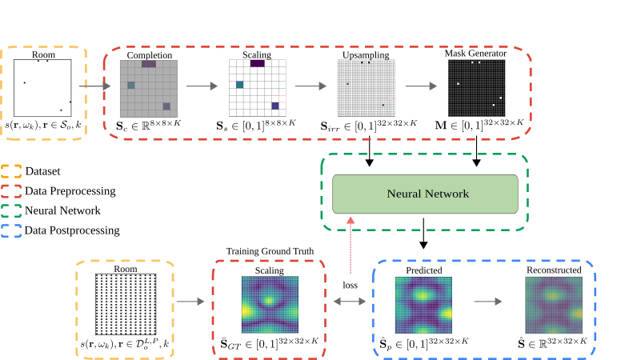

Sound field reconstruction in rooms: inpainting meets superresolution
====

Deep learning for sound field reconstruction in rooms.

[Paper](https://arxiv.org/abs/2001.11263) by Francesc Lluís, Pablo Martínez-Nuevo, Martin Bo Møller, Sven Ewan Shepstone

We provide an implementation of the deep-learning-based method for sound field reconstruction presented in the aforementioned paper. It uses a limited number of arbitrary discrete measurements of the magnitude of the sound field pressure in order to extrapolate this field to a higher-resolution grid of discrete points in space with a low computational complexity. The method is based on a U-net-like neural network with partial convolutions trained solely on simulated data, i.e. the dataset is constructed from numerical simulations of the Green's function across thousands of common rectangular rooms. Although extensible to three dimensions, the method focuses on reconstructing a two-dimensional plane of the room from measurements of the three-dimensional sound field.

## Algorithm Design

Note that the provided pre-trained model predicts the 2D sound field with 1/12th octave frequency resolution in the range [30, 296] Hz

## Features
* Suitable for rectangular rooms
* Low number of microphones required
* Accommodate irregular microphone distributions
* Efficient Inference

## Setup

1. Install [miniconda](https://docs.conda.io/en/latest/miniconda.html)
2. `git clone https://github.com/francesclluis/sound-field-neural-network.git`
3. `cd sound-field-neural-network/`
3. `conda env create -f environment.yml`
4. `conda activate sfun`
5. `./download_sample_dataset.sh` (~211MB)  or `./download_full_dataset.sh` (~62GB)

Check [this issue](https://github.com/francesclluis/sound-field-neural-network/issues/1) if you get errors when running `conda env create -f environment.yml`.

The project has been tested with Keras 2.2.4, CUDA 8.0, CUDNN 7.1.3 on Ubuntu 18.04 LTS. We reuse code from [MathiasGruber/PConv-Keras](https://github.com/MathiasGruber/PConv-Keras).

## Usage

There are four operating modes: training, simulated data evaluation, real data evaluation, and visualization. A JSON-formatted configuration file defines the parameters of an existing or a new session. The structure of this configuration file is described [here](config/config.md).

#### Training

Training sessions are differentiated from one another by a session ID defined in `config.json`. All artifacts generated during training are placed in a folder corresponding to this session ID in the `sessions/` folder.

To start training: `python main.py --mode train --config <path_to_config_file>`. Training will begin after the dataset is prepared for training.

Alternatively, there is a pre-trained model available in the `sessions/` folder for quickly trying out with test data.

#### Simulated Data Evaluation

To begin the simulated data evaluation: `python main.py --mode sim-eval --config <path_to_config_file>`. Note: --config should contain the path to a configuration file *in a session folder*.

To evaluate a model we present every room in the simulated test set with several microphones locations to the most recent checkpoint present in a session folder, and calculate the Normalized Mean Square Error (NMSE) and the Structural Similarity (SSIM) over all analyzed frequencies.

A new directory named `simulated_data_evaluation` is created inside the session folder. It contains a `.csv` file (for each room) containg each individual result and plots showing the performance of the model regarding the metrics and the number of microphones.

#### Real Data Evaluation

To begin the real data evaluation: `python main.py --mode real-eval --config <path_to_config_file>`. Note: --config should contain the path to a configuration file *in a session folder*.

To evaluate a model we present the measured real room with several microphones locations to the most recent checkpoint present in a session folder, and calculate the Normalized Mean Square Error (NMSE) and the Structural Similarity (SSIM) over all analyzed frequencies.

A new directory named `real_data_evaluation` is created inside the session folder. It contains a `.csv` file containg each individual result and plots for both source locations showing the performance of the model regarding the metrics and the number of microphones.

#### Visualization

We may wish to visualize the sound field reconstruction on real data.

To visualize on real data: `python main.py --mode visualize --config <path_to_config_file>`. Note: --config should contain the path to a configuration file *in a session folder*.

A new directory named `visualization` is created inside the session folder. It contains images of the ground truth sound field, the irregular sound field gathered, the mask, and the predicted sound field for each analyzed frequency. It is used the most recent checkpoint present in the session folder.

## Dataset

Scripts used for generating simulated sound fields are provided inside the `create_data` folder. Tested under Matlab 2018. Special thanks to Martin Bo Møller for the Green's function implementation.

Alternatively, download the dataset (simulated and real sound fields) by running `./download_full_dataset.sh`

